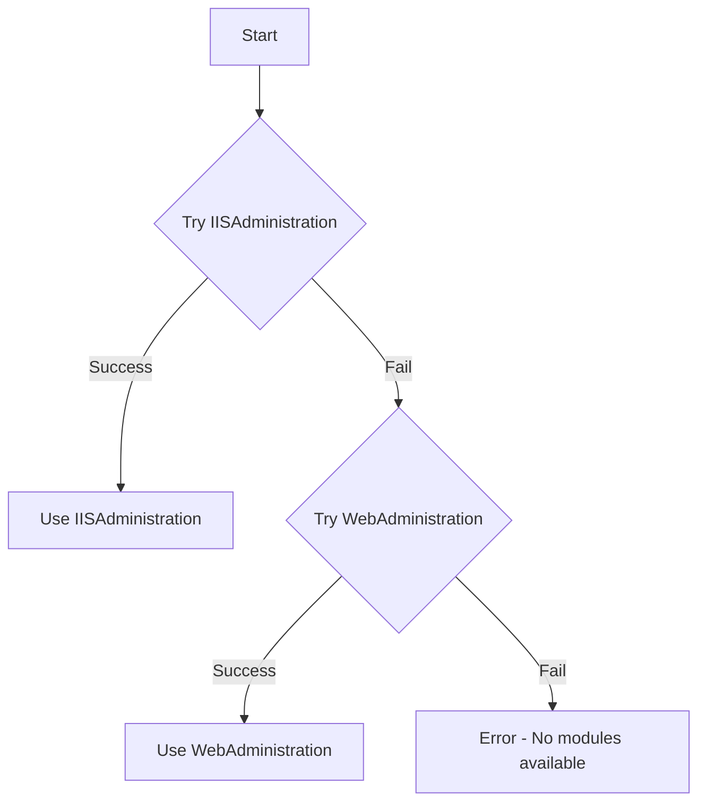

# IIS Migration Scripts

> A comprehensive toolkit for migrating IIS websites, application pools, and configurations between Windows servers using Microsoft Web Deploy

[](https://opensource.org/licenses/MIT)
[](https://docs.microsoft.com/en-us/powershell/)
[](https://www.microsoft.com/windows/)

## 📋 Table of Contents

- [Overview](#overview)
- [Features](#features)
- [Prerequisites](#prerequisites)
- [Installation](#installation)
- [Quick Start](#quick-start)
- [Architecture](#architecture)
- [Scripts Reference](#scripts-reference)
  - [Source Scripts](#source-scripts)
  - [Destination Scripts](#destination-scripts)
  - [GUI Tool](#gui-tool)
- [Usage Examples](#usage-examples)
- [Configuration](#configuration)
- [Troubleshooting](#troubleshooting)
- [Contributing](#contributing)
- [License](#license)
- [Support](#support)

## 🎯 Overview

This project provides a complete solution for migrating Internet Information Services (IIS) websites and their configurations between Windows servers. It leverages Microsoft Web Deploy (msdeploy) to ensure accurate and efficient migration of websites, application pools, permissions, and settings.

The toolkit includes both command-line scripts and a powerful GUI tool for building and executing complex migration commands, making it suitable for both automated and interactive migration scenarios.

## ✨ Features

### Core Migration Features

- **Complete IIS Website Migration**: Migrate entire websites including bindings, application pools, and configurations
- **Application Pool Management**: Automatic handling of application pool configurations and identities
- **ACL Synchronization**: Preserve file and folder permissions during migration
- **Batch Processing**: Migrate multiple websites in batches with configurable batch sizes
- **Dry Run Support**: Validate migration plans without making actual changes

### GUI Tool Features

- **Visual Command Builder**: Intuitive GUI for building complex msdeploy commands
- **Real-time Preview**: See the exact command that will be executed before running
- **Configuration Templates**: Save and load common migration configurations
- **Side-by-side Comparison**: Mirror or swap source/destination configurations
- **Comprehensive Logging**: Detailed logs for troubleshooting and audit trails

### Advanced Features

- **Dual Module Support**: Automatically falls back between IISAdministration and WebAdministration modules
- **User Management**: Automatic creation of IIS-specific user accounts
- **Error Recovery**: Robust error handling with detailed logging
- **Network Migration**: Remote server migration support
- **Flexible Authentication**: Support for various authentication methods

## 🔧 Prerequisites

### System Requirements

- **Operating System**: Windows Server 2012 R2, Windows Server 2016, Windows Server 2019, or Windows 10/11
- **PowerShell**: Version 5.1 or later
- **Administrator Privileges**: All scripts require elevated permissions
- **IIS**: Internet Information Services installed on both source and destination servers

### Required Software

1. **Microsoft Web Deploy V3**: Must be installed at `C:\Program Files\IIS\Microsoft Web Deploy V3\msdeploy.exe`
   - Download: [Microsoft Web Deploy](https://www.microsoft.com/en-us/download/details.aspx?id=43717)

2. **IIS Management Tools**:

   ```powershell
   Add-WindowsFeature Web-Server, Web-Mgmt-Tools, Web-Scripting-Tools, Web-Mgmt-Console
   ```

### Required PowerShell Modules

- `WebAdministration` (primary)
- `IISAdministration` (fallback)

## 🚀 Installation

1. **Clone the repository**:

   ```bash
   git clone https://github.com/yourusername/iis-migration-scripts.git
   cd iis-migration-scripts
   ```

2. **Verify prerequisites**:

   ```powershell
   # Check Web Deploy installation
   Test-Path "C:\Program Files\IIS\Microsoft Web Deploy V3\msdeploy.exe"

   # Verify PowerShell modules
   Get-Module -ListAvailable WebAdministration, IISAdministration
   ```

3. **Run as Administrator**: All scripts require elevated privileges

## ⚡ Quick Start

### Basic Website Migration

1. **On Source Server**: Export website configuration

   ```powershell
   .\source-scripts\export-acls.bat
   ```

2. **On Source Server**: Migrate websites to destination

   ```powershell
   .\source-scripts\migrate-websites.ps1 -DestinatoinServerIP "192.168.1.100" -DestUsername "admin" -DestPassword (ConvertTo-SecureString "password" -AsPlainText -Force)
   ```

3. **On Destination Server**: Create required IIS users

   ```powershell
   .\destination-scripts\create-iis-users.ps1
   ```

4. **On Destination Server**: Import ACLs

   ```powershell
   .\destination-scripts\import-acls-from-csv.ps1
   ```

### Using the GUI Tool

```powershell
.\gui-migrate.ps1
```

The GUI provides an intuitive interface for building migration commands with real-time preview and execution capabilities.

## 🏗️ Architecture

### Two-Tier Script Structure

The project follows a two-tier architecture designed for secure and efficient migration:

```
┌─────────────────┐    ┌─────────────────┐
│  Source Server  │───▶│ Destination     │
│                 │    │ Server          │
│  - Export ACLs  │    │                 │
│  - Migrate      │    │  - Create Users │
│    Sites        │    │  - Import ACLs  │
│  - Package      │    │  - Fix Config   │
│    Data         │    │                 │
└─────────────────┘    └─────────────────┘
```

### Module Fallback Architecture

The scripts implement intelligent module fallback:



## 📜 Scripts Reference

### Source Scripts

Located in `source-scripts/`, these scripts run on the source server to export and migrate data.

#### `migrate-websites.ps1`

Main migration script for transferring IIS websites to a destination server.

**Parameters:**

- `-StartIndex`: Starting index for batch processing (default: 0)
- `-BatchSize`: Number of sites to process in each batch (default: 1)
- `-DestinatoinServerIP`: Destination server IP address
- `-DestUsername`: Username for destination server authentication
- `-DestPassword`: SecureString password for destination server
- `-WhatIf`: Preview mode - shows commands without executing

**Usage Examples:**

```powershell
# Migrate all sites
.\migrate-websites.ps1 -DestinatoinServerIP "192.168.1.100" -DestUsername "admin" -DestPassword $securePass

# Migrate single site
.\migrate-websites.ps1 -StartIndex 5 -BatchSize 1 -DestinatoinServerIP "192.168.1.100" -DestUsername "admin" -DestPassword $securePass

# Dry run
.\migrate-websites.ps1 -WhatIf -DestinatoinServerIP "192.168.1.100" -DestUsername "admin" -DestPassword $securePass
```

#### `export-acls-to-csv.ps1`

Exports Access Control Lists (ACLs) for all IIS websites to CSV format for later import.

```powershell
.\export-acls-to-csv.ps1
```

#### `export-acls.bat`

Batch wrapper for ACL export functionality.

```cmd
.\export-acls.bat
```

#### `gui-migrate-websites.ps1`

GUI version of the migration script with visual site selection.

### Destination Scripts

Located in `destination-scripts/`, these scripts run on the destination server to set up the environment.

#### `create-iis-users.ps1`

Creates IIS-specific user accounts and sets up necessary permissions.

```powershell
.\create-iis-users.ps1
```

#### `import-acls-from-csv.ps1`

Imports ACL configurations from CSV files exported by source scripts.

```powershell
.\import-acls-from-csv.ps1
```

#### `pull-from-remote.ps1`

Pulls migration data from the source server.

```powershell
.\pull-from-remote.ps1 -SourceServerIP "192.168.1.50"
```

#### `fix-ip.ps1`

Optional script to fix IP address configurations after migration.

```powershell
.\fix-ip.ps1
```

### GUI Tool

#### `gui-migrate.ps1`

A comprehensive GUI application for building and executing msdeploy commands.

**Features:**

- Visual command builder with real-time preview
- Support for all msdeploy providers and verbs
- Configuration save/load functionality
- Side-by-side source/destination configuration
- Comprehensive logging and error handling

**Key UI Components:**

- **Source Configuration**: Configure source provider, connection, and options
- **Destination Configuration**: Configure destination provider, connection, and options
- **Global Settings**: Configure verbs, flags, rules, and link extensions
- **Command Preview**: Real-time command preview with execute/copy options
- **Activity Log**: Detailed execution logs with timestamps

## 💡 Usage Examples

### Complete Migration Workflow

```powershell
# Step 1: On source server - Export ACLs
.\source-scripts\export-acls.bat

# Step 2: On source server - Migrate websites (example with 5 sites per batch)
.\source-scripts\migrate-websites.ps1 -BatchSize 5 -DestinatoinServerIP "192.168.1.100" -DestUsername "admin" -DestPassword $securePass

# Step 3: On destination server - Create IIS users
.\destination-scripts\create-iis-users.ps1

# Step 4: On destination server - Import ACLs
.\destination-scripts\import-acls-from-csv.ps1

# Step 5: On destination server - Fix IP if needed
.\destination-scripts\fix-ip.ps1
```

### Using the GUI for Complex Migrations

```powershell
# Launch GUI tool
.\gui-migrate.ps1

# In the GUI:
# 1. Configure source provider (e.g., appHostConfig for IIS sites)
# 2. Set source connection (computerName, userName, password)
# 3. Configure destination provider
# 4. Set destination connection
# 5. Select appropriate verbs, flags, and rules
# 6. Review the generated command in the preview area
# 7. Execute or copy the command
```

### PowerShell Module Integration

```powershell
# Import required modules
Import-Module .\MigrationHelper.psm1
Import-Module .\GuiHelpers.psm1
Import-Module .\GuiStateHelpers.psm1

# Use helper functions for custom scripts
$config = Get-SideConfiguration -Side "Source" -SideControls $sideControls -ProviderUiStates $providerUiStates
```

## ⚙️ Configuration

### Environment Variables

No global environment variables required. All configuration is done via script parameters and the GUI interface.

### Logging Configuration

Logs are automatically created in:

- `.\migrate-websites.log` - Main migration log
- `.\site-logs\` - Individual site migration logs
- `gui-msdeploy-YYYYMMDD-HHMMSS.log` - GUI execution logs

### Known Issues and Workarounds

1. **Variable Naming Inconsistencies**: The project maintains legacy variable names for compatibility:
   - `$name` vs `$sitename` - both refer to the same site
   - `$DestinatoinServerIP` (with typo) - parameter name preserved for backward compatibility

2. **Application Pool Handling**: Application pool objects may return as arrays, always use `$pool[0]` for extraction.

3. **msdeploy Command Execution**: All msdeploy commands must be wrapped in `cmd.exe /c` for proper execution.

## 🔍 Troubleshooting

### Common Issues

#### 1. "WebAdministration module not found"

**Solution**: Install IIS Management Tools

```powershell
Add-WindowsFeature Web-Mgmt-Tools, Web-Scripting-Tools, Web-Mgmt-Console
```

#### 2. "msdeploy.exe not found"

**Solution**: Install Microsoft Web Deploy V3

- Download from Microsoft Download Center
- Install to default location: `C:\Program Files\IIS\Microsoft Web Deploy V3\`

#### 3. "Access denied" errors

**Solution**: Ensure scripts are run as Administrator

```powershell
# Right-click PowerShell -> "Run as administrator"
# Or use:
Start-Process powershell -Verb runAs
```

#### 4. ACL synchronization failures

**Note**: ACL sync failures are non-fatal. The migration continues but warnings are logged. Check `.\site-logs\` for detailed information.

#### 5. Authentication failures

**Solution**: Verify credentials and authentication type

- Use IP addresses when possible
- Ensure proper authentication method is selected (Basic, NTLM, Negotiate)
- Check firewall settings for msdeploy communication

### Debug Mode

Enable verbose logging and dry-run mode for troubleshooting:

```powershell
# Enable WhatIf mode for safe testing
.\source-scripts\migrate-websites.ps1 -WhatIf -DestinatoinServerIP "192.168.1.100" -DestUsername "admin" -DestPassword $securePass

# Check logs for detailed information
Get-Content .\migrate-websites.log
Get-Content .\site-logs\*-*.log
```

### Log Analysis

Common log patterns to look for:

- `ERROR`: Critical issues that stopped migration
- `WARNING`: Non-critical issues (like ACL sync failures)
- `WHATIF`: Commands that would be executed in dry-run mode
- `SUCCESS`: Successful operations

## 🤝 Contributing

We welcome contributions to improve this project! Please follow these guidelines:

### Getting Started

1. Fork the repository
2. Create a feature branch: `git checkout -b feature/your-feature-name`
3. Make your changes
4. Test thoroughly
5. Submit a pull request

### Development Guidelines

1. **Code Style**: Follow PowerShell best practices and existing code style
2. **Documentation**: Update documentation for any new features or changes
3. **Testing**: Test all changes in a safe environment before submitting
4. **Backward Compatibility**: Maintain compatibility with existing parameters and behavior

### Contribution Areas

- 🐛 **Bug Fixes**: Fix issues in existing functionality
- ✨ **New Features**: Add new migration capabilities
- 📚 **Documentation**: Improve documentation and examples
- 🧪 **Testing**: Add test coverage and validation scripts
- 🔧 **Refactoring**: Improve code organization and maintainability

### Pull Request Process

1. Ensure your code follows the existing style and patterns
2. Update README.md with any new features or changes
3. Test your changes thoroughly
4. Include a clear description of the changes
5. Reference any related issues

### Reporting Issues

When reporting issues, please include:

- Operating system and version
- PowerShell version
- IIS version
- Complete error messages
- Steps to reproduce the issue
- Expected vs actual behavior

## 📄 License

This project is licensed under the MIT License - see the [LICENSE](LICENSE) file for details.

## 📞 Support

### Getting Help

- **GitHub Issues**: [Report bugs or request features](https://github.com/yourusername/iis-migration-scripts/issues)
- **Documentation**: Check this README and inline code comments
- **Logs**: Review the log files for detailed error information

### Professional Support

For enterprise support, custom modifications, or migration consulting services, please contact [your-email@domain.com].

### Community

- **Discussions**: Use GitHub Discussions for questions and general discussion
- **Wiki**: Additional documentation and examples in the project wiki

---

**Note**: This project is designed for Windows environments with IIS. Ensure you have appropriate backups and test migrations in a non-production environment before performing live migrations.
